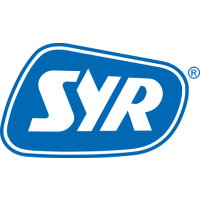

# ioBroker.syrconnect

Simulates the Syrconnect cloud (www.syrconnect.de) that the Connect devices want to connect to. The adapter provides a web server
which serves as a new target for the Connect devices (e.g. Lex10).

## Documentation

[🇺🇸 Documentation](./docs/en/README.md)

[🇩🇪 Dokumentation](./docs/de/README.md)

## Changelog

<!--
  Placeholder for the next version (at the beginning of the line):
  ### **WORK IN PROGRESS**
-->

### **WORK IN PROGRESS**

- (eifel-tech) Changed type of Port in Amdin to number

### 1.1.2 (2024-12-17)

- (eifel-tech) Adhere to iobroker specifications

### 1.1.1 (2024-11-11)

- (eifel-tech) Data sent on LEXplus10SL changed (Issue #194)

### 1.1.0 (2024-10-30)

- (eifel-tech) Added dependency to [iobroker web server](https://github.com/ioBroker/webserver).
- (eifel-tech) Error handling improved
- (eifel-tech) Device added: LEXplus10SL

### 1.0.1 (2024-10-25)

- (eifel-tech) Conversion to current adapter structure

### 0.0.1

- (eifel-tech) initial release

## License

MIT License

Copyright (c) 2024 eifel-tech <hikaso@gmx.net>

Permission is hereby granted, free of charge, to any person obtaining a copy
of this software and associated documentation files (the "Software"), to deal
in the Software without restriction, including without limitation the rights
to use, copy, modify, merge, publish, distribute, sublicense, and/or sell
copies of the Software, and to permit persons to whom the Software is
furnished to do so, subject to the following conditions:

The above copyright notice and this permission notice shall be included in all
copies or substantial portions of the Software.

THE SOFTWARE IS PROVIDED "AS IS", WITHOUT WARRANTY OF ANY KIND, EXPRESS OR
IMPLIED, INCLUDING BUT NOT LIMITED TO THE WARRANTIES OF MERCHANTABILITY,
FITNESS FOR A PARTICULAR PURPOSE AND NONINFRINGEMENT. IN NO EVENT SHALL THE
AUTHORS OR COPYRIGHT HOLDERS BE LIABLE FOR ANY CLAIM, DAMAGES OR OTHER
LIABILITY, WHETHER IN AN ACTION OF CONTRACT, TORT OR OTHERWISE, ARISING FROM,
OUT OF OR IN CONNECTION WITH THE SOFTWARE OR THE USE OR OTHER DEALINGS IN THE
SOFTWARE.
