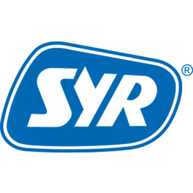

# ioBroker.syrconnect

Simulates the Syrconnect cloud that the Connect devices want to connect to. The adapter provides a web server
which serves as a new target for the Connect devices (e.g. Lex10). This evaluates and generates the data sent
corresponding data points. In order for the devices to find the new server, the following requirements must be created:

1. The device asks the configured DNS server for the domain `syrconnect.consoft.de`. That's why one has to
   Your own DNS server must be installed, which returns an IP from the local network. E.g. `Dnsmasq` does what is necessary here.
2. The local IP must point to a local web server listening on port `80` or `443` on `/WebServices/SyrConnectLimexWebService.asmx/GetBasicCommands` and `/WebServices/SyrConnectLimexWebService.asmx/GetAllCommands`.

    - This can be [the adapter itself](#adapter-as-webserver), but there are a few things to consider.

    - Reroute all requests to a higher port can also be done using [iptables](#reroute-with-iptables).

    - However, an [additional web server](#additional-webserver) (e.g. [Apache](https://httpd.apache.org/)), which then forwards all requests to the adapter, is recommended `<iobroker-IP>:<configured port>/GetBasicCommands` or `<iobroker-IP>:<configured port>/GetAllCommands` forwards. Alternatively, the requests can also be forwarded to `<iobroker-IP>:<configured port>/WebServices/SyrConnectLimexWebService.asmx/GetBasicCommands` or `<iobroker-IP>:<configured port>/WebServices/SyrConnectLimexWebService.asmx/GetAllCommands`.

3. The adapter definitely works up to firmware version 2.8. With newer firmware, various things may have changed that would no longer allow URL forwarding.

## Adapter as webserver

The adapter must be configured on port `80` or `443` (depending on which port the device sends on). Normally it is not possible to run servers on ports <1024 without root privileges. This is the case with iobroker. In order for this to still be possible under Linux, the following command must be called in the console on the iobroker server:

```
sudo setcap 'cap_net_bind_service=+ep' `which node`
```

The following should be noted:

-   This method allows all ports <1024 to be opened to the outside world. Only the corresponding port needs to be entered in the adapter instance. Therefore, it must be ensured that the iobroker server is **not** accessible from the Internet, otherwise access may be possible via the configured port. **Therefore, this method is not recommended unless you know what you are doing!**
-   The command must be run again after a node version update.

## Reroute with iptables

Without an additional advertising server, all requests under Linux can be redirected to the adapter using iptables. To do this, enter the following in the console. In the example, all requests via port `80` and `443` are redirected to port `8090`:

```
sudo iptables -A PREROUTING -t nat -i ens18 -p tcp --dport 80 -j REDIRECT --to-port 8090 sudo iptables -A PREROUTING -t nat -i ens18 -p tcp --dport 443 -j REDIRECT --to-port 8090
```

It is important to note that **all** requests coming to the server from any system on the network will be redirected to the adapter's configured port, not just those from a Syr device.

## Additional webserver

I recommend using an additional web server (Apache, nginx etc.) to forward the requests to the adapter. Here you can specifically set who requests are allowed, which ports they can come in through and how exactly the forwarding should take place. There are numerous examples of this on the internet.

For example, for an Apache web server on the same server that runs iobroker, a redirect might look like this. Only the requests from the Syr device from its own network are taken into account here. These are redirected to `localhost` and the port `8090` configured in the adapter.

```
<Location /WebServices/SyrConnectLimexWebService.asmx/>
	Require ip 127.0.0.1 ::1
   Require host localhost
   Require ip <locale IP of Syr device>

   RewriteEngine on
	RewriteCond %{REQUEST_URI} ^\/WebServices\/SyrConnectLimexWebService\.asmx\/(.*)$
    RewriteRule ^(.*)$ http://localhost:8090/%1 [QSA,P,L]
</Location>
```

## Supported devices

-   Lex10
-   LexPlus10SL

## TODOs

-   Implement additional devices
-   If an API for querying the values ​​is installed with newer firmware, the adapter should be converted so that the values ​​come directly from the API. Then there would be no need for your own DNS and web server.
